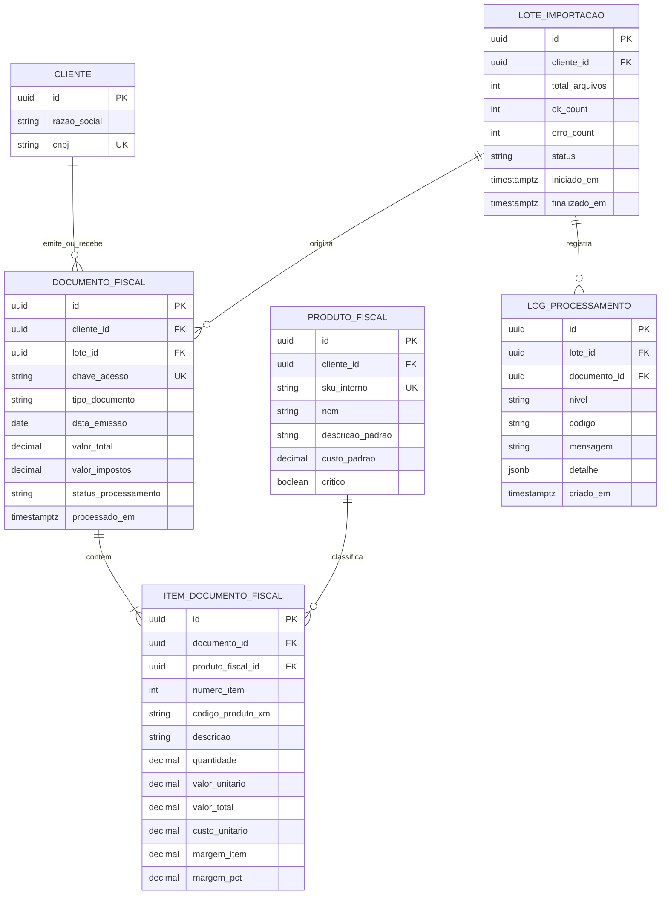
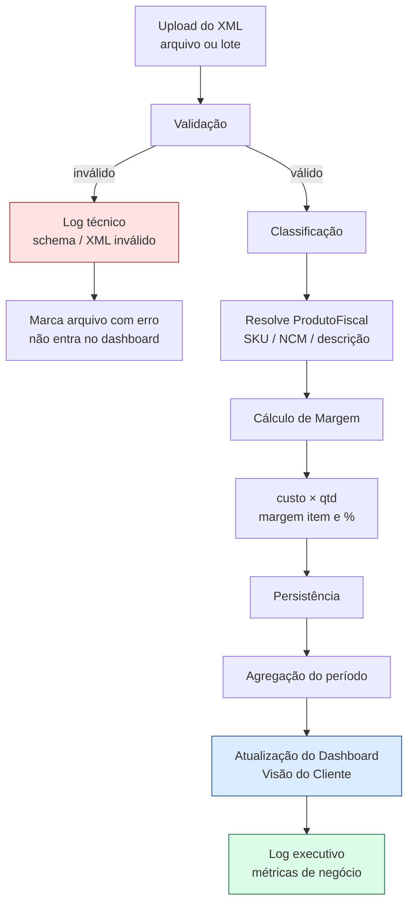

# Visão Técnica · Cliente (Módulo XML)

**Público:** engenharia, dados, suporte L2.  
**Objetivo:** arquitetura e processamento que alimentam a Visão do Cliente.

Complementa: [`01-visao-funcional.md`](./01-visao-funcional.md)

---

## 1. Modelo entidade-relacionamento (ERD)

### 1.1 Diagrama



### 1.2 Cardinalidade

| Relação | Cardinalidade | Regra |
|---------|---------------|-------|
| Cliente → DocumentoFiscal | 1:N | Toda nota pertence a um cliente |
| DocumentoFiscal → ItemDocumentoFiscal | 1:N (mín. 1) | Nota sem item não entra no dashboard |
| ProdutoFiscal → ItemDocumentoFiscal | 1:N | Item pode ficar sem produto até classificação |
| LoteImportacao → DocumentoFiscal | 1:N | Upload unitário gera lote de 1 arquivo |

### 1.3 Chaves e índices (busca rápida)

| Tabela | PK | UK / índices sugeridos |
|--------|----|-------------------------|
| `documento_fiscal` | `id` | UK `chave_acesso`; IDX `(cliente_id, data_emissao DESC)`; IDX `(cliente_id, status_processamento)`; IDX `lote_id` |
| `item_documento_fiscal` | `id` | UK `(documento_id, numero_item)`; IDX `produto_fiscal_id`; IDX `(documento_id)` INCLUDE valores/margem |
| `produto_fiscal` | `id` | UK `(cliente_id, sku_interno)`; IDX `(cliente_id, critico)` WHERE `critico = true`; IDX `ncm` |
| `lote_importacao` | `id` | IDX `(cliente_id, iniciado_em DESC)` |
| `log_processamento` | `id` | IDX `(lote_id, nivel, criado_em)`; IDX `(codigo)` |

---

## 2. Pipeline — do XML à Visão do Cliente

### 2.1 Fluxograma



### 2.2 Passos (contrato técnico)

| # | Etapa | Entrada | Saída | SLA alvo (p95) |
|---|-------|---------|-------|----------------|
| 1 | Upload | multipart / S3 temp | `lote_id` + fila | < 2s por arquivo até 2 MB |
| 2 | Validação | bytes XML | ok \| erro tipado | < 300 ms |
| 3 | Classificação | itens parseados | `produto_fiscal_id` nullable | < 200 ms / nota |
| 4 | Cálculo de margem | item + custo | `margem_item`, `margem_pct` | < 50 ms / nota |
| 5 | Atualização dashboard | agregados do cliente/período | cache/materialized view | < 1s após último item do lote |

**Reflexo “instantâneo”:** após o passo 5, a Visão do Cliente lê da projeção agregada (não recalcula o XML na renderização).

---

## 3. Dicionário de dados — campos críticos do cliente

Campos exibidos ou usados para montar os 3 KPIs do topo e o diagnóstico.

| Campo (UI / API) | Tipo | Precisão | Negativo? | Obrigatório | Origem |
|------------------|------|----------|-----------|-------------|--------|
| `faturamento` | decimal | 2 casas (BRL) | Não (clamp ≥ 0 na UI; log se XML < 0) | Sim (agregado) | **Calculado:** `SUM(documento.valor_total)` filtrado por período e status `processado` |
| `impostos` | decimal | 2 casas | Não | Sim | **Calculado:** `SUM(documento.valor_impostos)` no mesmo filtro |
| `o_que_sobrou` / `margem_liquida` | decimal | 2 casas | **Sim** | Sim | **Calculado:** `faturamento − custos_alocados − impostos` (definir política de custo na classificação) |
| `margem_liquida_pct` | decimal | 1–2 casas | **Sim** | Sim se faturamento > 0 | **Calculado:** `(margem_liquida / faturamento) * 100` |
| `lucro_real_periodo` | decimal | 2 casas | **Sim** | Sim | **Calculado:** alias de negócio de `margem_liquida` no recorte XML (não substitui DRE contábil) |
| `qtd_notas` | integer | — | Não | Sim | **Calculado:** count documentos processados |
| `qtd_produtos_criticos` | integer | — | Não | Sim | **Calculado:** produtos com `critico = true` ou margem_pct < limiar |
| `item.margem_item` | decimal | 2 casas | **Sim** | Sim se classificado | **Calculado:** `valor_total − (custo_unitario × quantidade)` |
| `item.margem_pct` | decimal | 2 casas | **Sim** | Condicional | **Calculado:** `(margem_item / valor_total) * 100` se valor_total ≠ 0 |
| `documento.status_processamento` | enum | — | — | Sim | **Sistema:** `recebido` \| `validando` \| `processado` \| `erro` |
| `documento.chave_acesso` | string(44) | — | — | Sim (NF-e) | **XML** |
| `produto.custo_padrao` | decimal | 4 casas internas / 2 na UI | Não (0 permitido) | Não | Cadastro / regra; default 0 até classificar |

### 3.1 Limiar de produto crítico (configurável)

| Parâmetro | Default sugerido | Uso |
|-----------|------------------|-----|
| `margem_pct_critica` | `5.00` | Abaixo → diagnóstico |
| `margem_pct_negativa` | `0` | Abaixo → alerta vermelho |

---

## 4. UX técnica — lotes pesados (contrato de API/UI)

### 4.1 Eventos para a barra de progresso

Canal: WebSocket ou SSE `lote:{id}`.

```json
{
  "lote_id": "…",
  "status": "processando",
  "total": 120,
  "ok": 87,
  "erro": 3,
  "restantes": 30,
  "pct": 75.0,
  "eta_segundos": 42,
  "ultimo_arquivo": "nfe-3526….xml"
}
```

### 4.2 Mapeamento UI ← eventos

| Campo evento | Componente UI |
|--------------|---------------|
| `pct` | barra de progresso |
| `ok` / `erro` / `restantes` | contadores |
| `eta_segundos` | “cerca de X min restantes” (arredondar humanizado) |
| `status=concluido` | CTA “Ver no dashboard” + invalidação de cache do cliente |

### 4.3 Limites operacionais

| Limite | Valor sugerido |
|--------|----------------|
| Arquivos por lote | 500 |
| Tamanho/arquivo | 5 MB |
| Concorrência de parse | 8 workers |
| Retenção log técnico | 90 dias |
| Retenção log executivo | 24 meses |

---

## 5. Logs em dois níveis

### 5.1 Log executivo (`nivel = executivo`)

Para a Visão do Cliente / portal.

| Código | Mensagem (exemplo) | Métricas anexas |
|--------|--------------------|-----------------|
| `LOTE_INICIADO` | Importação iniciada | `total_arquivos` |
| `LOTE_PROGRESSO` | Processamento em andamento | `ok`, `erro`, `pct` |
| `LOTE_CONCLUIDO` | Lote finalizado | `ok`, `erro`, `faturamento_delta` |
| `NOTA_INCLUIDA` | Nota entrou no período | `chave`, `valor_total` |
| `NOTA_IGNORADA_CLIENTE` | Nota com problema (genérico) | `arquivo` (sem detalhe técnico) |

### 5.2 Log técnico (`nivel = tecnico`)

Para suporte e engenharia.

| Código | Quando | Detalhe (`jsonb`) |
|--------|--------|-------------------|
| `XML_SCHEMA_INVALIDO` | Falha XSD / estrutura | `xpath`, `schema_error` |
| `XML_PARSE_ERROR` | XML malformado | `offset`, `raw_snippet` |
| `CHAVE_DUPLICADA` | `chave_acesso` já existe | `chave`, `documento_id_existente` |
| `CLASSIFICACAO_FALHOU` | Sem match de produto | `codigo_produto_xml`, `ncm` |
| `CUSTO_AUSENTE` | Margem com custo 0 por fallback | `produto_id`, `politica` |
| `WORKER_TIMEOUT` | Tempo excedido no parse | `arquivo`, `duration_ms` |

**Regra:** todo `NOTA_IGNORADA_CLIENTE` no executivo deve ter **pelo menos um** log técnico correlacionado pelo mesmo `lote_id` + `arquivo`.

---

## 6. Agregação do dashboard (contrato)

```text
VisaoClientePeriodo(cliente_id, de, ate):
  docs = DocumentoFiscal
          WHERE cliente_id AND status = processado
            AND data_emissao BETWEEN de AND ate

  faturamento     = SUM(docs.valor_total)
  impostos        = SUM(docs.valor_impostos)
  custos          = SUM(itens.custo_unitario * itens.quantidade)  -- itens dos docs
  margem_liquida  = faturamento - custos - impostos
  lucro_real      = margem_liquida   -- alias de produto no recorte XML
  produtos_criticos = ProdutoFiscal WHERE critico OR margem agregada < limiar
```

Cache: chave `vc:{cliente_id}:{de}:{ate}:{versao_lote}` — invalidar ao concluir lote do cliente.

---

## 7. Critérios de aceite (engenharia)

- [ ] ERD persistido com UK de `chave_acesso` e índices de período por cliente
- [ ] Pipeline em 5 estágios com logs executivo + técnico correlacionados
- [ ] Dashboard lê agregação, não XML cru
- [ ] Eventos de lote alimentam barra, contadores e ETA
- [ ] Campos do dicionário respeitam precisão e política de negativos
- [ ] Erros de schema nunca vazam texto técnico para a UI do cliente

---

## 8. Relação com o protótipo atual

A aba XML no perfil do cliente (`menu-suspenso.html`) hoje lista NF-e/NFC-e/CT-e de forma stub. Esta especificação é o **contrato alvo** para evoluir essa aba para a hierarquia Resumo → Diagnóstico → Detalhamento descrita na visão funcional.
